# Polyp Dataset

This work aggregates publicly available colonoscopy datasets for polyp detection and classification. It serves as the dataset reference for the Polyp Detection Repository, where models such as YOLOv11, YOLOv12, RT-DETR were trained and evaluated.

Off the 8 publiclty available datasets, 3 datasets were recognized as benchmark datasets based on existing benchmarks set. And the other datasets were collomated together with an common naming convention and format, and were used for pretraining.

## 📌 Dataset Categorization  

### 🔹 Benchmark Datasets  
Three datasets were selected as **benchmarks** for evaluation, as they are widely adopted in prior research:  
- **CVC-ClinicDB**  
- **CVC-ColonDB**  
- **ETIS-LaribDB**  

These are used to ensure results are comparable with established baselines.  

---

### 🔹 Training Datasets  
The remaining datasets were **collated into a composite training set** and used for **pretraining**.  
This setup enables two modes of evaluation:  
- **Intra-dataset testing** → training and evaluating on splits of the same dataset.  
- **Inter-dataset testing** → training on one dataset and evaluating on unseen datasets (e.g., ETIS-LaribDB, CVC-ClinicDB, CVC-ColonDB) to assess **generalization**.  

---

## 📸 Sample Images  

| Dataset       | Samples |
|---------------|---------|
| **Kvasir-SEG** | 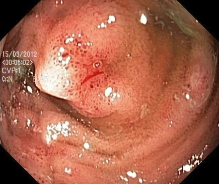 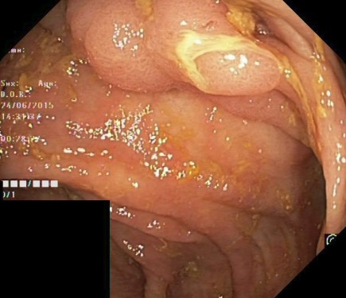 |
| **CVC-Clinic** | 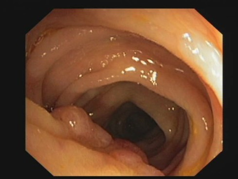 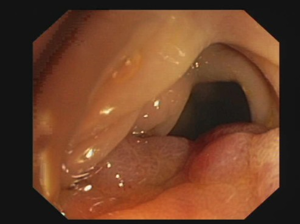 |
| **CVC-Colon**  | 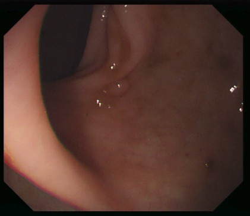 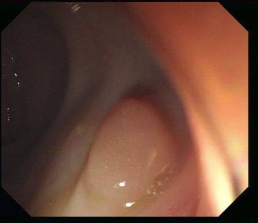 |
| **ETIS-Larib** | 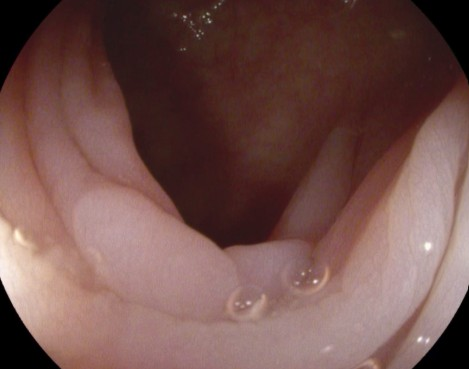 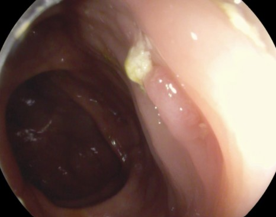 |
| **PolypGen**   | 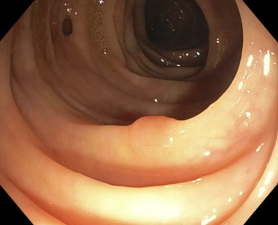 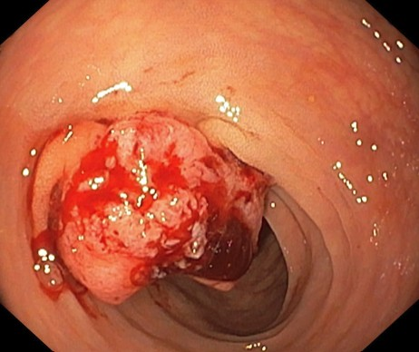 |
| **LD-PolypVideo** | 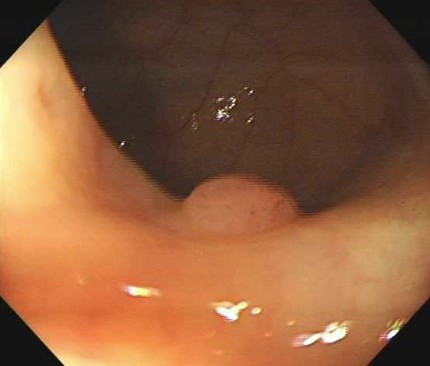 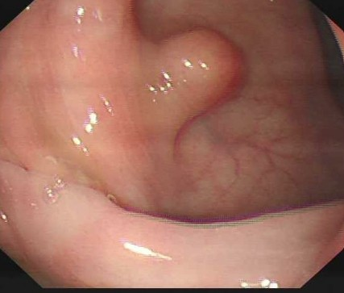 |
| **KUMC (PolypSet)** | 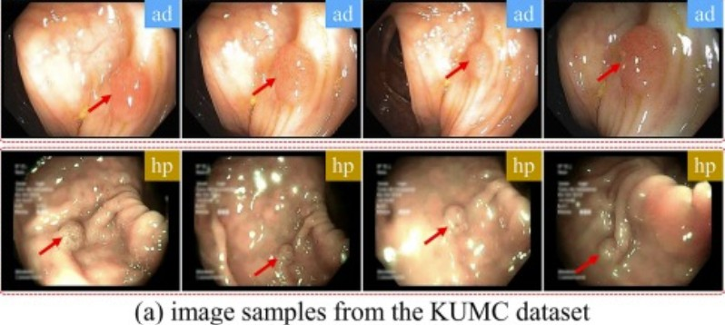 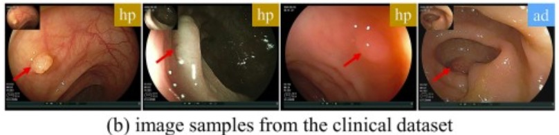 |

---

## 📊 Dataset Summary  

| Dataset              | Total Images | Polyp Images | Multiple Polyp Images | Non-Polyp Images |
|----------------------|-------------:|-------------:|----------------------:|-----------------:|
| **CVC-ClinicDB**     | 612          | 612          | 30                    | 0                |
| **CVC-ColonDB**      | 380          | 380          | –                     | 0                |
| **Kvasir-SEG**       | 1,000        | 1,000        | 48                    | 0                |
| **PolypGen**         | 1,473        | 1,347        | 123                   | 126              |
| **ETIS-LaribDB**     | 196          | 196          | 6                     | 0                |
| **LD-PolypVideo**    | 40,186       | 33,875       | 2,360                 | 6,311            |
| **KUMC (PolypSet)**  | 37,899       | 35,996       | 1                     | 1,903            |
| **Real-COLON (Raw)** | 138,091      | 15,660       | 3                     | 122,431          |
| **Real-COLON (Balanced)** | 76,876  | 15,660       | 3                     | 61,216           |
| **TOTAL (Raw)**      | 219,837      | 89,066       | –                     | 130,771          |
| **TOTAL (Balanced)** | 158,622      | 89,066       | –                     | 69,556           |

---

## 📁 Dataset Organization  

### 🔹 DATA  
The `DATA/` folder contains the **collated master dataset**.  
- All images and annotations from multiple sources (Kvasir-SEG, CVC, PolypGen, LD-PolypVideo, Real-COLON, KUMC, etc.) are unified here.  
- Files are renamed with a **dataset prefix** (e.g., `Kvasir-SEG_xxx.jpg`, `realcolon_xxx.jpg`, `kumc_xxx.jpg`, `polypgen_xxx.jpg`) for **traceability**.  
- A `log.txt` file summarizes dataset integrity and statistics, including:  
  - Total number of images and annotations.  
  - Count of polyp vs. non-polyp images.  
  - Multiple polyp cases.  
  - Polyp count distribution (when available).  

---

### 🔹 SPLITDATA  
The `SPLITDATA/` folder contains **train/validation/test splits** derived from the `DATA/` folder.  
- Splits are applied **across the combined dataset**, not per individual dataset.  
- A `log.txt` file records:  
  - Split sizes (train/val/test).  
  - Polyp vs. non-polyp counts.  
  - Multiple-polyp statistics.  

---

### 🔹 SEGDATASETS  
The `SegDatasets/` folder contains datasets with **segmentation masks**.  
- Datasets like **Kvasir-SEG, CVC-Clinic, CVC-Colon, ETIS-Larib** are organized in subfolders.  
- Each subfolder includes **images, masks, and logs** (`log.txt`).  
- Logs provide:  
  - Dataset size.  
  - Multiple polyp breakdowns.  
  - CSVs with normalized image–mask paths for training pipelines.  

---

### 🔹 Logs & Integrity Checks  
Every dataset folder (`DATA/`, `SPLITDATA/`, `SegDatasets/`) includes a `log.txt` file.  
These ensure **reproducibility** by documenting:  
- Image–annotation matches.  
- Polyp vs. non-polyp distribution.  
- Multiple-polyp file references.  

---

### 🔹 Balancing Strategy  
Some datasets, particularly **Real-COLON**, contained a large imbalance of **non-polyp vs. polyp images**.  
- To address this, **non-polyp samples were reduced by half** in each subset.  
- This produced **balanced versions** of the dataset, improving training stability and reducing bias toward negative samples.  

------

##  Disclaimer  
This work was done solely for **documentation of personal research** and for **keeping track of dataset preparation steps**.  
It is **not intended to be fully reproducible** or directly used as a standardized dataset.  

For any clarifications, discussions, or further details, feel free to reach out.  

---

## 📬 Contact  
- **Name**: M. Lakshminarayanan  
- **Email**: lakshminarayanan.m678@gmail.com

---

## 📖 References  
- **Kvasir-SEG Dataset** – https://datasets.simula.no/kvasir-seg/
- **CVC-ClinicDB** – https://www.dropbox.com/scl/fi/ky766dwcxt9meq3aklkip/CVC-ClinicDB.rar?dl=0&e=1&file_subpath=%2FCVC-ClinicDB&rlkey=61xclnrraadf1niqdvldlds93
- **CVC-ColonDB** - https://www.kaggle.com/datasets/longvil/cvc-colondb
- **ETIS-Larib Polyp DB** – https://service.tib.eu/ldmservice/dataset/etis-larib-polyp-db  
- **KUMC PolypSet** – https://dataverse.harvard.edu/dataset.xhtml?persistentId=doi:10.7910/DVN/FCBUOR
- **PolypGen Dataset** – [https://polypgen.github.io/](https://polypgen.github.io/)  
- **LD-PolypVideo Dataset** – [https://github.com/dashishi/LDPolypVideo-Benchmark](https://github.com/dashishi/LDPolypVideo-Benchmark)  
- **Real-COLON Dataset** – https://plus.figshare.com/articles/media/REAL-colon_dataset/22202866 

---
